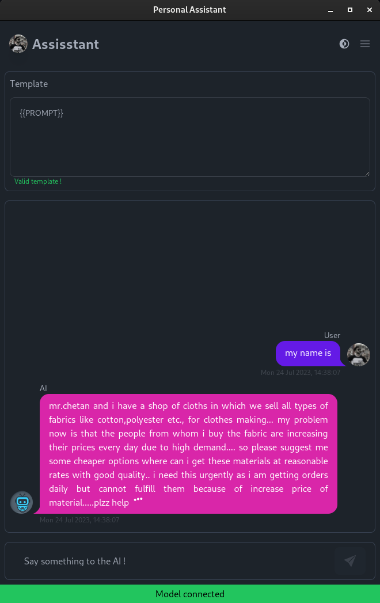

# Personal assistant

Personal assistant is an APP that allows the user to use a variety of widely distributed open source Large Language Modes (LLM) on a personal computer.

<video src="https://github.com/Mouradost/personal-assistant/assets/17816194/5644784d-e18c-4d3c-8ed1-500c900a4b9c" controls="controls" width="100%" >
 </video>

## Note

This is only a demo and is in early stages, it's not yet ready for production !

## Examples

    
    
    
    
    

